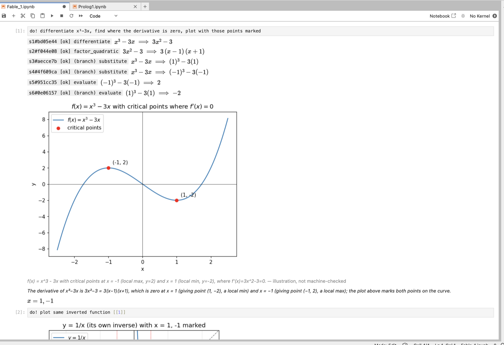

# ToyMath

ToyMath is a LaTeX-native symbolic mathematics system built around a simple
idea: let an LLM choose the strategy, but never ask it to certify its own
algebra.

The agent works through narrow, named transformations. ToyMath executes each
move, checks it independently, and records the derivation in a replayable
ledger.

```text
do! differentiate x^3 - 3x, find where the derivative is zero, plot with those points marked
```



## What is different?

Most tools combine mathematical strategy and execution in one place. ToyMath
separates three roles:

1. **Strategy — the agent.** It decides whether to expand, factor, substitute,
   split a task, or use an integration tactic.
2. **Mechanism — deterministic transformations.** ToyMath performs the
   requested algebra on its notation graph.
3. **Verification — an independent numeric oracle.** The result is checked by
   a path that shares no symbolic implementation with the transformation.

| | Conventional CAS | LLM-only math | ToyMath |
|---|---|---|---|
| Strategy | hidden inside large operations | visible but unconstrained | chosen by the agent |
| Intermediate steps | often reconstructed afterward | generated as prose | produced by named tools |
| Checking | trusts the symbolic engine | usually self-checks | independent oracle per move |
| Artifact | final answer | conversation | replayable derivation ledger |
| Side conditions | often implicit | easy to omit | recorded with the step |

There is deliberately no general `solve`, `simplify`, `factor`, or autonomous
`integrate`. Those operations would hide the chain that ToyMath is designed to
preserve. Instead, the agent composes smaller tactics such as
`apply_both_sides`, `expand`, `factor_quadratic`, `integrate_by_parts`, and
`substitute`.

Results are described as **mechanically checked**, not proved. Canonical
algebra is exact where supported; the independent oracle is reproducible but
probabilistic outside that fragment. Assumptions such as `a + b \ne 0` remain
attached to the derivation.

## Math commands compose

Reusable notebook commands are Markdown prompt templates in `commands/`:

```text
int! x^3
diff! \sin x
solve! 2x + 3 = 7
```

Commands marked as expression-capable can be nested directly in LaTeX:

```text
{diff! {int! x^3}}          -> x^3
{int! x^2} + {int! x^2}     -> 2/3 x^3 + 2C
2 {diff! x^2} - 1           -> 4x - 1
```

Subcommands resolve from the inside out. Their arithmetic glue is combined by
the deterministic `expand` primitive and checked by the oracle—without another
LLM call.

## Surfaces

- **Jupyter:** `do!` accepts a free-form instruction; `[[n]]` chains results
  across cells; steps stream into a notebook-wide ledger.
- **Named commands:** `name!` loads reusable instructions from `commands/*.md`.
- **Inline composition:** `{name! expression}` embeds checked sub-derivations
  inside a larger expression.
- **CLI:** `toymath_cli.py` exposes the same primitives as deterministic JSON
  commands and can save or replay a ledger.
- **Classic kernel:** the original fixed-point LaTeX rewrite engine remains the
  parser, notation-DAG, and command substrate beneath the agentic layer.

Plots are optional illustrations, never evidence. Agent-generated plotting
code runs outside the kernel in a deny-by-default Pyodide/Deno sandbox and does
not enter the ledger.

## Quick start

Requirements: Python 3.11+, [uv](https://docs.astral.sh/uv/), and JupyterLab.
[Deno](https://deno.com) is optional for sandboxed plotting.

```bash
git clone https://github.com/semyonc/toymath.git
cd toymath
uv venv
source .venv/bin/activate
uv pip install -r requirements.txt
jupyter kernelspec install kernel_spec --user

# Required only for do! and prompt commands
echo 'OPEN_ROUTER=sk-or-...' >> .env

jupyter lab
```

Pick the **Toy Math** kernel. Console mode is also available with
`python console.py`.

## Read more

- [Project overview](docs/OVERVIEW.md) — architecture, interfaces, commands,
  setup, testing, and repository map
- [Verified primitives](doc/PRIMITIVES.md) — trust model, oracle, tactics, and
  ledger format
- [Notation graph](doc/NOTATION.md) — DAG representation and traversal
- [Developer guide](CLAUDE.md) — classic engine and extension details

Run the offline test suite with `pytest`. Live OpenRouter and sandbox probes
are opt-in; the commands are documented in the project overview.

MIT License · Semyon C
